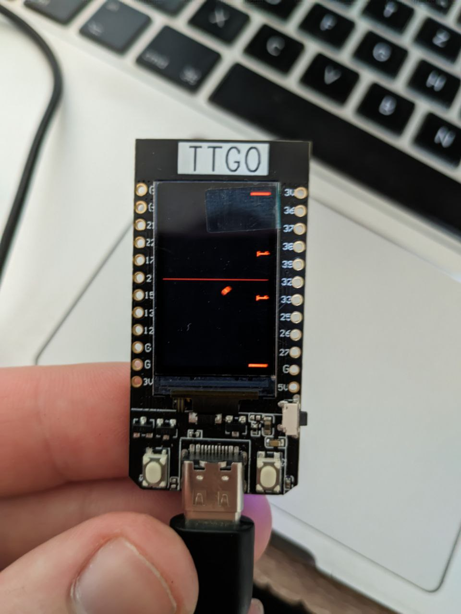
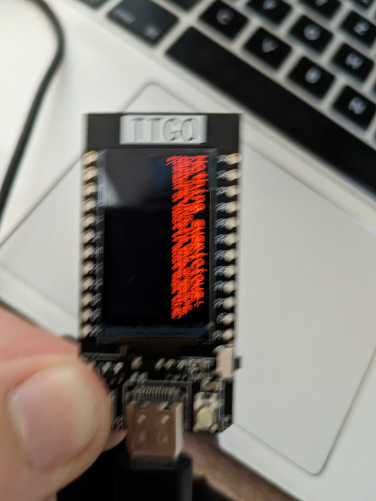
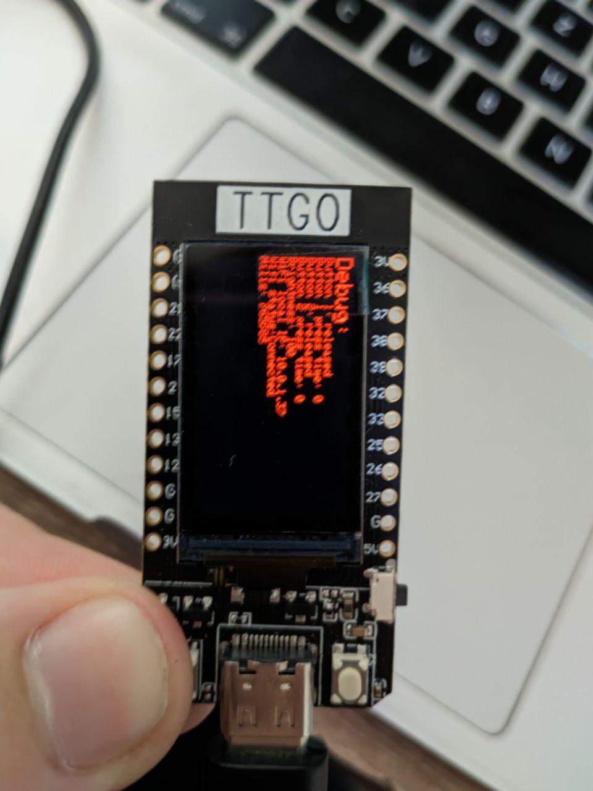
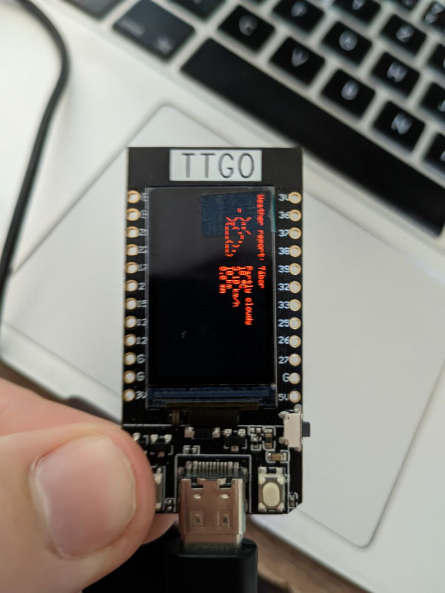

# Watch OS
- made for lilygo ttgo t-display esp32
- compile using arduino cli / ide, might have to change some flags in the adafruit libraries
# Controls
- there is a long and a short press for each button and both at once

# Features
- time
- weather
- pong game
- images
- simple settings
- network scanning
- cheating in school(you can add your own text to a widget, for educational purposes only)

# Must do
- config the wifi in the main file at the top

# Images

